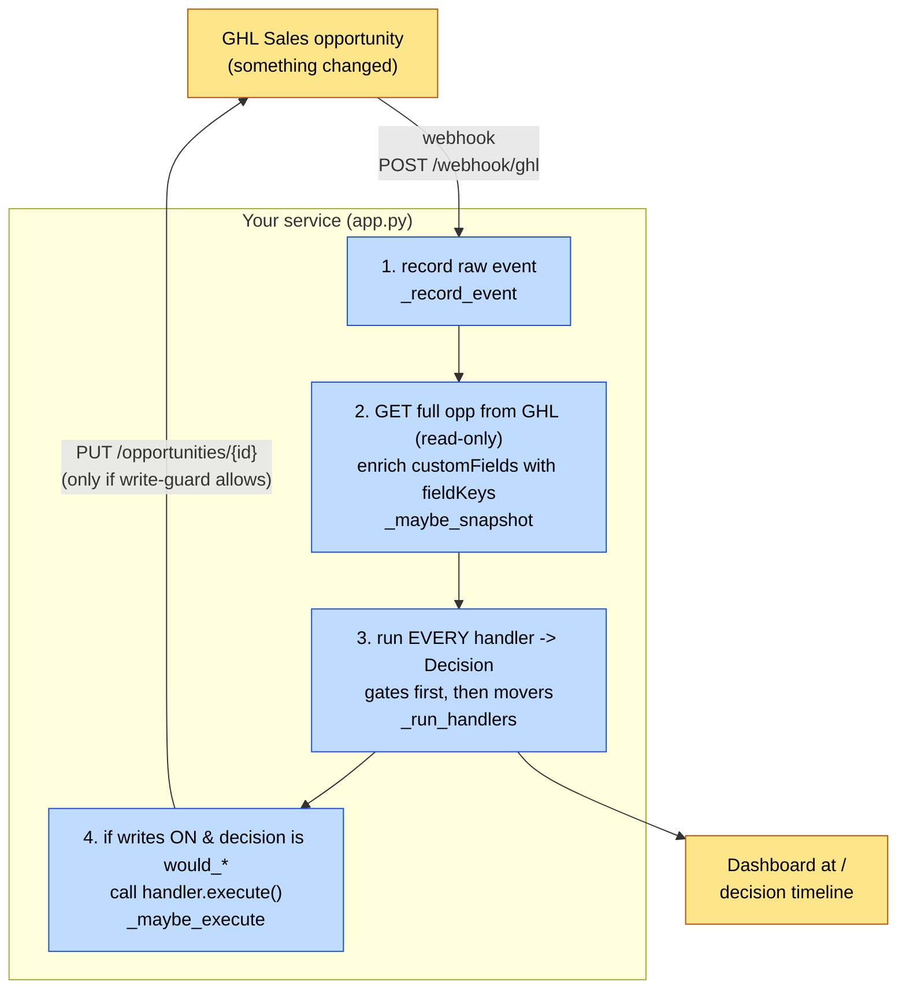
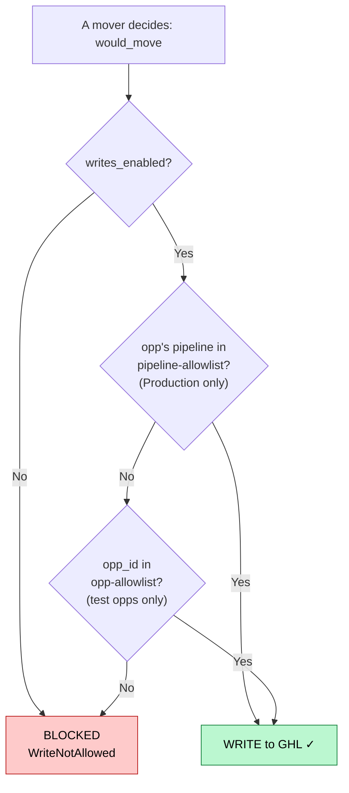
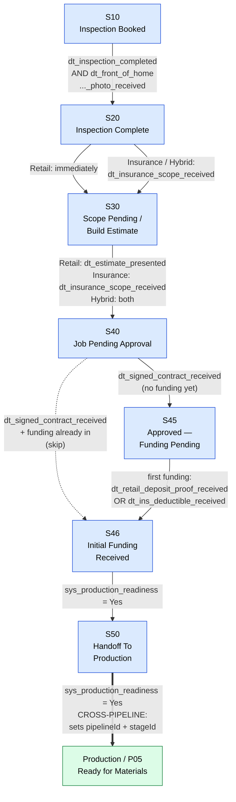
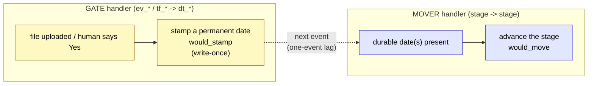

# Sales Pipeline — How It Works

> Generated diagrams of the code-driven Sales pipeline (Smart Roofing AI / ghl-2).
> Open in VSCode Markdown preview (with a Mermaid extension) or on GitHub to render.

---

## 1. Architecture — how one event flows

---

## 2. The write-safety guard (why live deals are never touched)

*Result: a Production opp writes via the pipeline rule; a Sales **test** opp writes via the opp rule; every other live Sales deal only gets a logged "would move…" and is never PUT.*

---

## 3. The Sales pipeline state machine (proof gates + job-type forks)

---

## 4. Gate vs Mover (the two handler types)

*A gate stamps the date on **this** event; the mover that depends on it fires on the **next** event. Movers key off durable date stamps, never raw file presence.*
